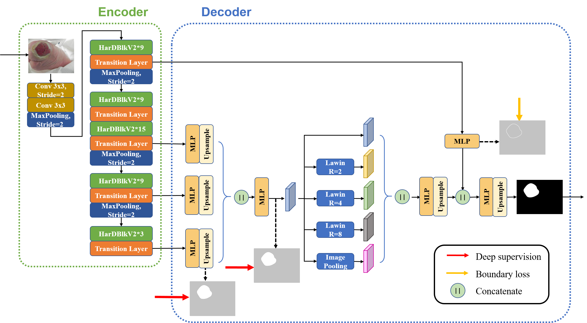

# Enhancing Backbone and Decoder of HarDNet-MSEG for Diabetic Foot Ulcer Segmentation


## 1st Place in Test Phase of DFUC 2022!
Official PyTorch implementation of HarDNet-DFUS, contains the prediction codes for our submission to the **Diabetic Foot Ulcer Segmentation Challenge 2022 (DFUC2022)** at **MICCAI2022**.


## HarDNet Family
*inference on V100*
#### For Image Classification : [HarDNet](https://github.com/PingoLH/Pytorch-HarDNet) 78.0 top-1 acc. / 1029.76 Throughput on ImageNet-1K @224x224
#### For Object Detection : [CenterNet-HarDNet](https://github.com/PingoLH/CenterNet-HarDNet) 44.3 mAP / 60 FPS on COCO val @512x512
#### For Semantic Segmentation : [FC-HarDNet](https://github.com/PingoLH/FCHarDNet)  75.9% mIoU / 68 FPS on Cityscapes test @1024x2048(w/o fuse, transform)
#### For Polyp Segmentation : [HarDNet-MSEG](https://github.com/james128333/HarDNet-MSEG) 90.4% mDice / 119 FPS on Kvasir-SEG @352x352


## Main Results
<p align="center">

</p>

We propose an accuracy-oriented HarDNet-MSEG, enhancing its backbone and decoder for DFUC.

| Method | DFUC val <br>  mDice| DFUC test <br>  mDice|
| :---: | :---: | :---: | 
| HarDNet-MSEG  | 65.53 | n/a |
| **HarDNet-DFUS**  |  **70.63**  | **72.87** |

#### Sample Inference and Visualized Results of FUC Dataset

<p align="center">

</p>


## Installation

```
conda create -n dfuc python=3.6
conda activate dfuc
pip install -r requirements.txt
```


## Training
First, download [weights](https://drive.google.com/drive/folders/1UbuMKLUlCsZAusUVLJqwcBaXiwe0ZUe8?usp=sharing) and place in the folder ``` /weights ``` 


Run:
```
python train.py --rect --augmentation --train_path /path/to/training/data

Optional Args:
--rect         Padding image to square before resize to keep its aspect ratio
--augmentation Activating data audmentation during training
--kfold        Specifying the number of K-Fold Cross-Validation
--k            Training the specific fold of K-Fold Cross-Validation
--dataratio    Specifying the ratio of data for training
--seed         Reproducing the result of data spliting in dataloader
--train_path   Path to training data
```

Train w/ 5-fold


Run:
```
python train.py --rect --augmentation --train_path /path/to/training/data --kfold 5
```

## Testing


Run:
```
python test.py --rect --weight path/to/weight/or/folder --test_path path/to/testing/data

Optional Args:
--rect         Padding image to square before resize to keep its aspect ratio
--tta          Test time augmentation, 'v/h/vh' for verti/horiz/verti&horiz flip
--weight       It can be a weight or a fold. If it's a folder, the result is the mean of each weight result
--test_path    Path to testing data
```


### Our Submissions in Test Phase 

Download the weights and place in the same folder, specifying the folder in --weight when testing.

Please ensure there is no other weight in the folder to obtain the same result.

Note that **LawinLoss** corresponds to the model of HarDNet-DFUS using deep1 and boundary loss, while **LawinLoss4** corresponds to the model of HarDNet-DFUS using deep1, deep2, and boundary loss. 

[Weights for LawinLoss](https://drive.google.com/drive/folders/1f7tCvP6Mj4ZFZJPvRcvvspdwvWljkrK0?usp=sharing) 

[Weights for LawinLoss4](https://drive.google.com/drive/folders/15hhsl1CIvOqa60friINmhnMB3qKRD-5p?usp=sharing)

1. **LawinLoss**(HarDNet-DFUS+deep1+boundary)
```
python test.py --rect --modelname lawinloss --weight /path/to/lawinloss_weight/folder --test_path /path/to/testing/data
```
2. **LawinLoss**(HarDNet-DFUS+deep1+boundary) with TTA **hflip**
```
python test.py --rect --modelname lawinloss --weight /path/to/lawinloss_weight/folder --test_path /path/to/testing/data --tta h
```
3. **LawinLoss4**(HarDNet-DFUS+deep1+deep2+boundary) with TTA **hflip**
```
python test.py --rect --modelname lawinloss4 --weight /path/to/lawinloss4_weight/folder --test_path /path/to/testing/data --tta h 
```
4. **LawinLoss4**(HarDNet-DFUS+deep1+deep2+boundary) with TTA **vflip**
```
python test.py --rect --modelname lawinloss4 --weight /path/to/lawinloss4_weight/folder --test_path /path/to/testing/data --tta v
```
5. **LawinLoss4**(HarDNet-DFUS+deep1+deep2+boundary) with TTA **vhflip**
```
python test.py --rect --modelname lawinloss4 --weight /path/to/lawinloss4_weight/folder --test_path /path/to/testing/data --tta vh
```
